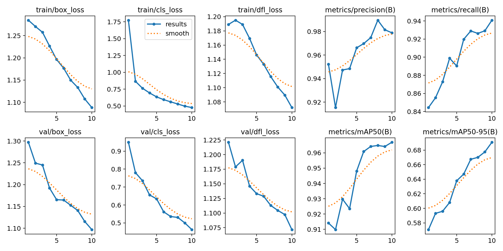

# Automatic Number Plate Recognition(Computer Vision Project)

## Description
The goal of this project is to detect cars Number Plate in a video using YOLO. 
The model was trained with Yolov8

## Output

## Model Result

## Dataset
The dataset was taken from the robowflow website:
https://universe.roboflow.com/roboflow-universe-projects/license-plate-recognition-rxg4e/dataset/4

## Files Structure
- 'Training_model_YOLO.ipynb' : Code to train the YOLO model.
- 'detection_vidio.py'        : Code to detect licence plate in a video
- 'detection_imge.py'         : Code to detect licence plate in a image
- 'vidieo'                    : Folder of vidieo
- 'models'                    : Folder of models
- 'output_result'             : Folder of output and model result

## Requirements
To run this project, you need to have the following requirements installed:

Python
ultralytics
OpenCV

