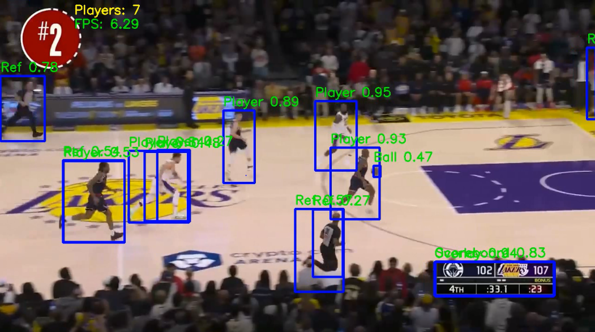
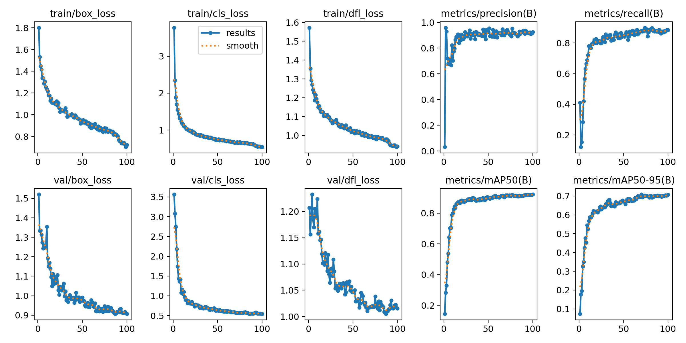
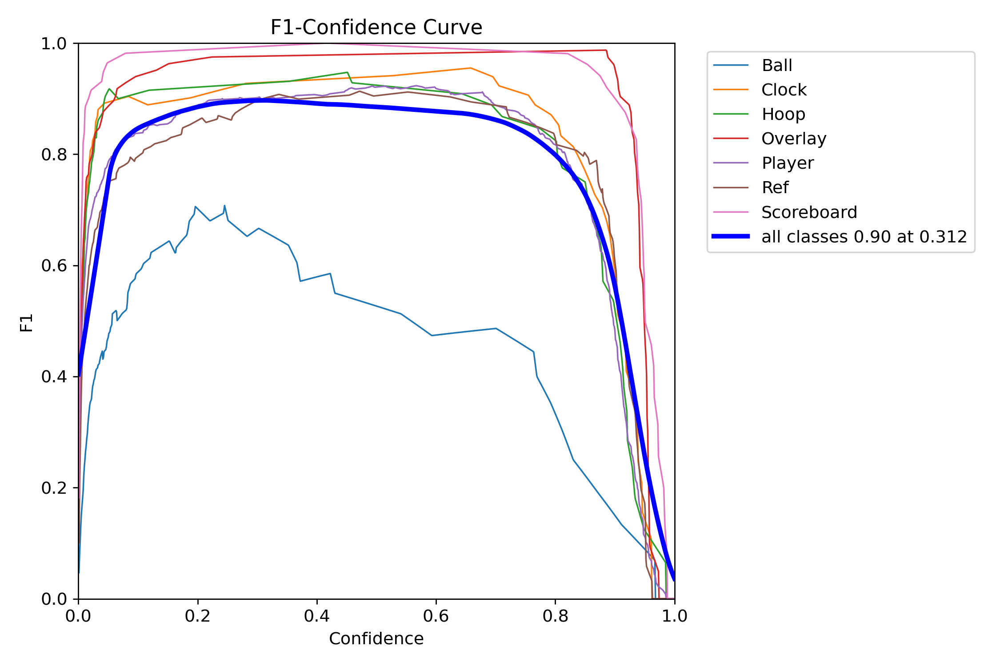

# BasketBall Players Detection

## Description
This project implements a real-time BasketBall Players detection system using YOLOv8 (Ultralytics).The system can:
-Detect BasketBall Players
-Measures the time it takes to execute YOLO on each frame.
-Calculates FPS(Frames per second)to determine the model's performance.

## Output

## Model Result

## Requirements
To run this project, you need to have the following requirements installed:

Python
ultralytics
OpenCV

