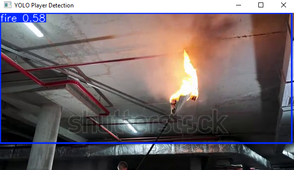
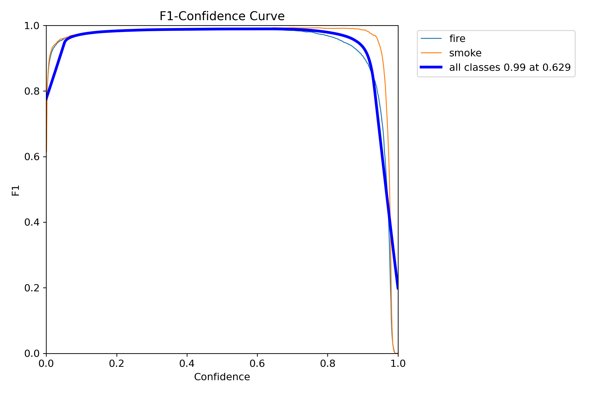
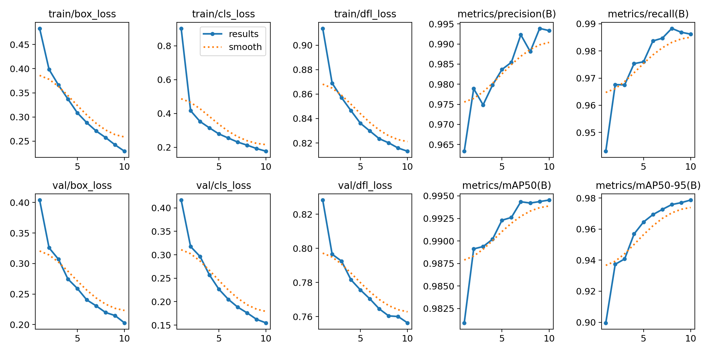

# Fire & Smoke Detection

## Overview
This project implements a real-time fire and smoke detection system using YOLOv8 (Ultralytics). 
The system can:
- Detect fire and smoke in live video streams or pre-recorded videos
- Trigger visual and audio alarms upon detection

## Output

## Model Result

## Model Result

## Features
- Train Yolov8 object detection on a custom dataset.
- Multi-alarm system.

## Dataset
The dataset I used is from roboflow:
https://universe.roboflow.com/ds/50j6YkqkPg?key=CM0RrOygWx
