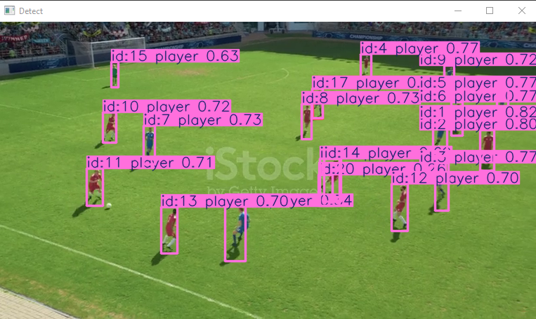
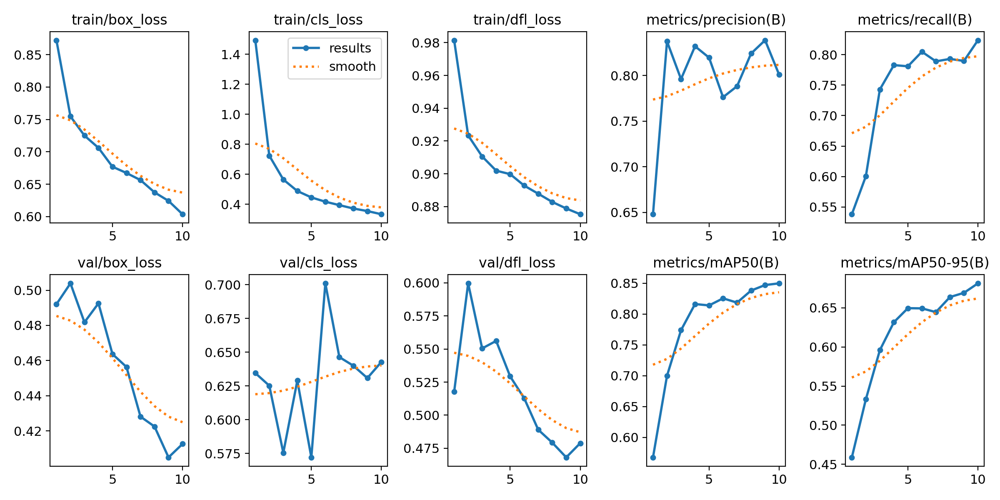

# Football Players Detection & Tracking (Computer Vision Project)

## Description
The goal of this project is to detect and track players, referees, and football in a video using YOLO. 

## Output

## Model Result

## Dataset
The dataset was taken from the robowflow website:
Robowflow Football Dataset:https://universe.roboflow.com/match/match-iwuzw/dataset/2

## Files Structure
- 'Football_players_training_YOLO.ipynb' : Code to train the YOLO model.
- 'football_players_detection.py'        : Code to detect and track players, referees, and football in a video
- 'vidieo'                               : Folder of vidieo
- 'models'                               : Folder of models
- 'output_result'                        : Folder of output and model result

## Requirements
To run this project, you need to have the following requirements installed:

Python
ultralytics
OpenCV

