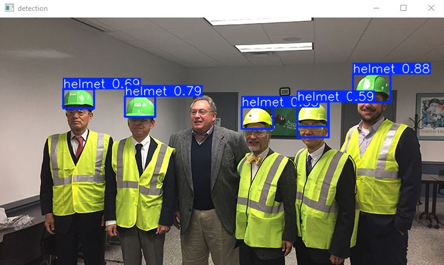

# Safety Helmet Detection (Computer Vision Project)

## Description
Object detection system developed with deep learning techniques, 
capable to recognize if workers in construction areas are using their safety helmet in mandatory areas.

Safety Helmet will be an integrated part of a dedicated ecosystem for secure safety habits on working dangerous areas, 
focusing on the scalability of the detection system trying to make it capable of covering the most scenarios posibles.

## Output

## Features
- Uses YOLO to train Model.
- Trains on  dataset to detect safety helmet.

## Files Structure
- 'safety_helmet_detection_(Training_Model).ipynb': Code to train the model.
- 'safety_helmet_detection_image.py'              : Code to detect safety helmet on image 
- 'safety_helmet_detection_vidieo.py'             : Code to detect safety helmet on vidieo 
- 'images'                                        : Folder of images
- 'vidieo'                                        : Folder of vidieo
- 'models'                                        : Folder of models

## Note
The data was taken from the robotflow website.
